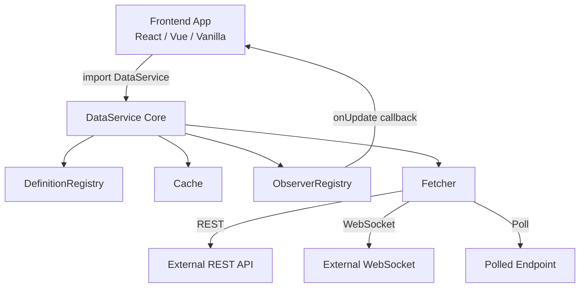
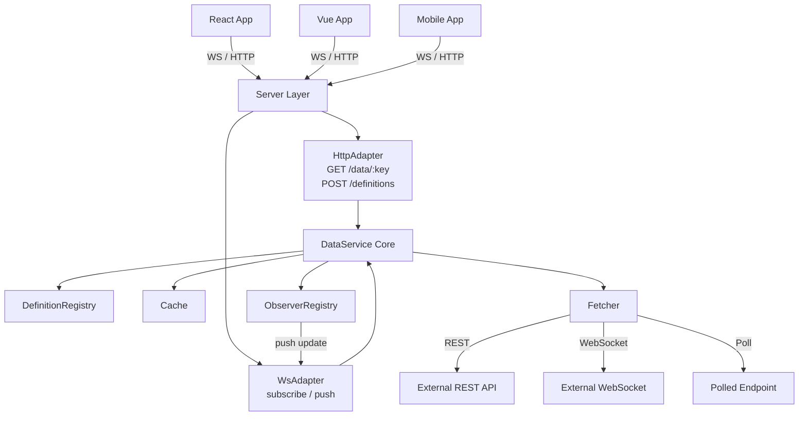
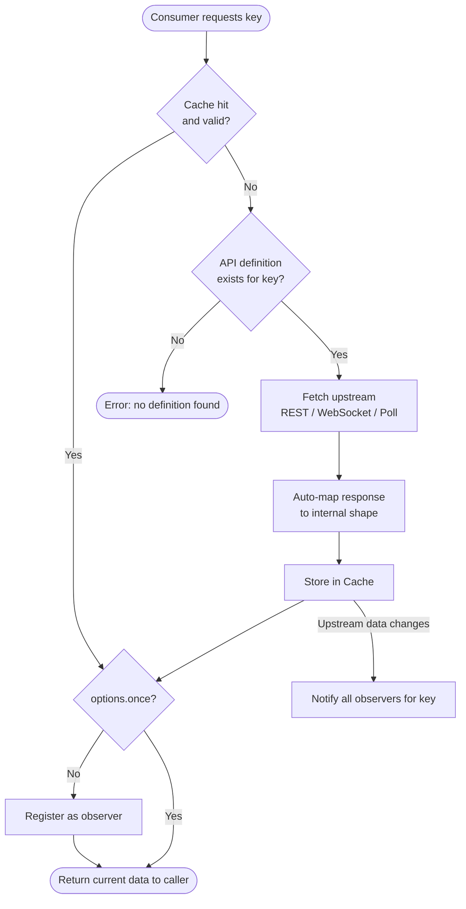
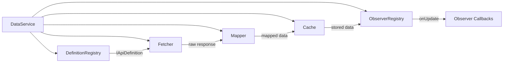
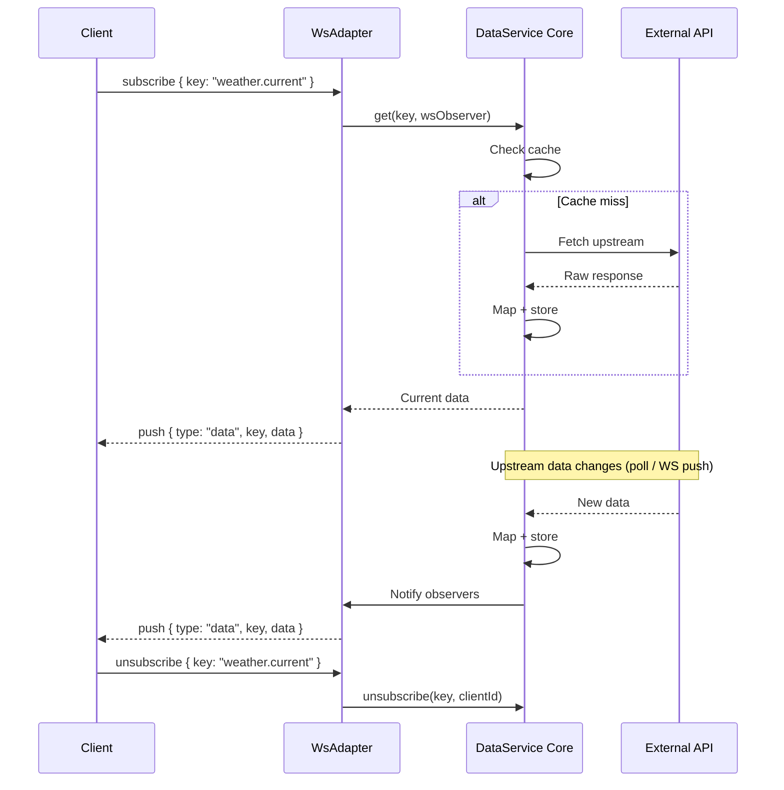
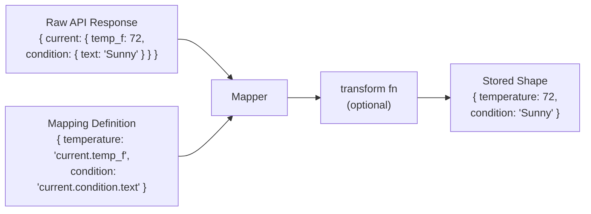

# DataService — Architecture Diagrams

## Deployment Modes

### Library Mode

---

### Microservice Mode

---

## Request Flow

---

## Module Relationships

---

## WebSocket Protocol (Microservice Mode)

---

## Data Mapping

