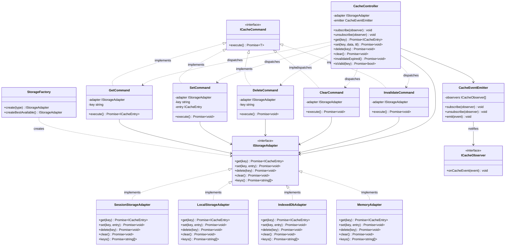
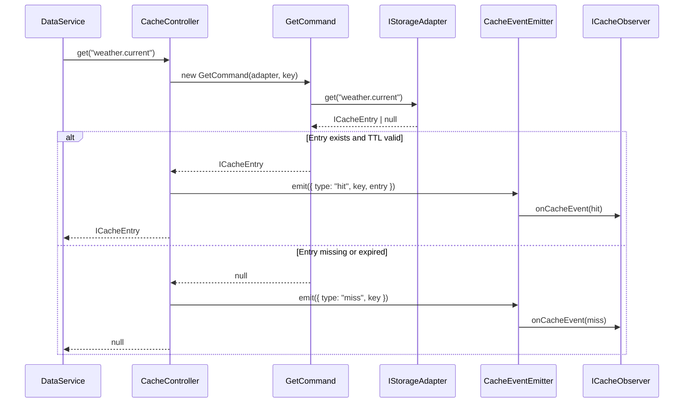
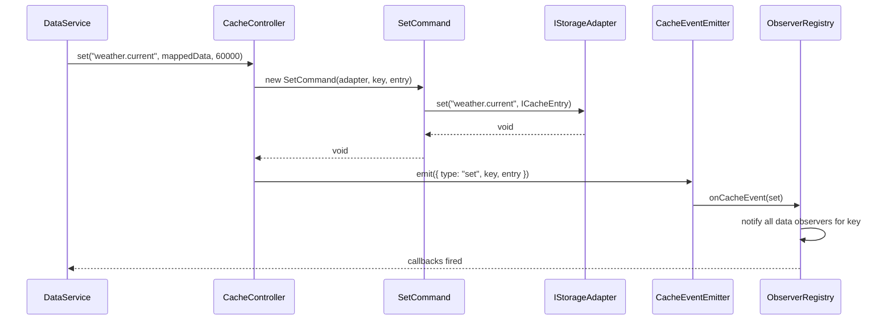
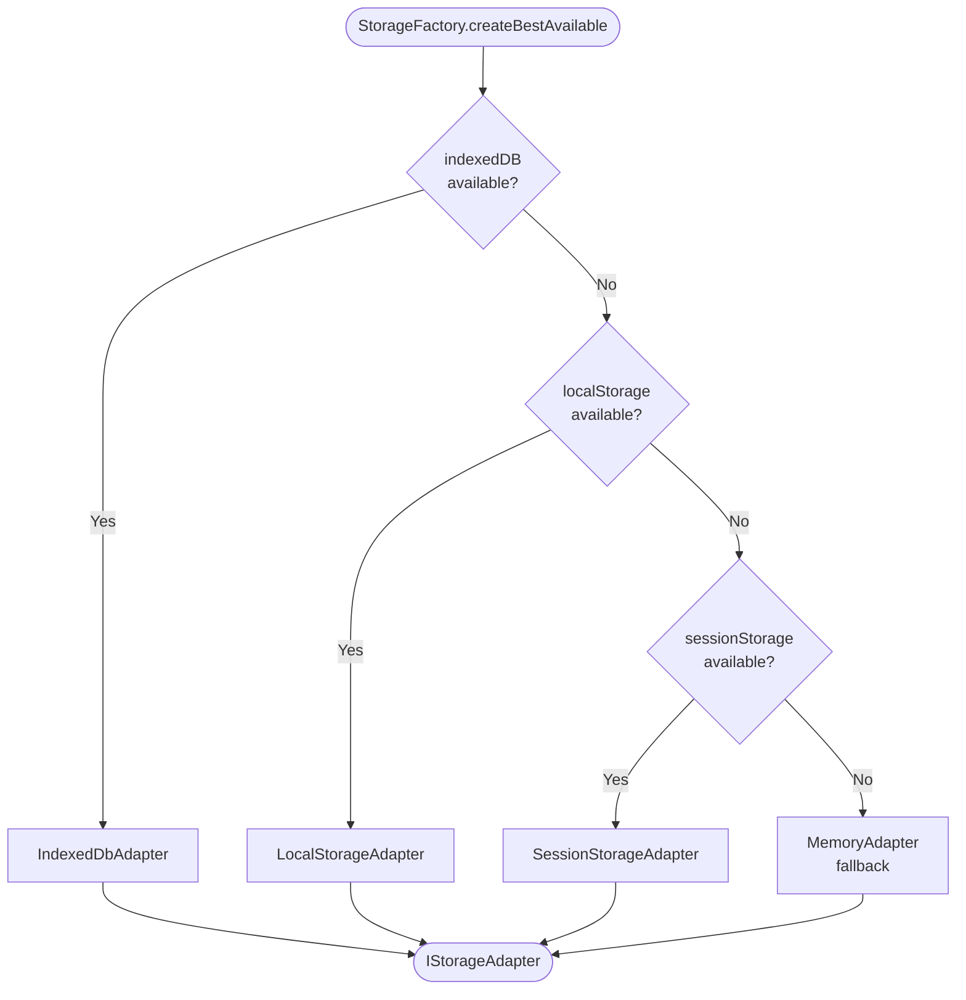

# Cache System Design

## Overview

The cache is a fully independent subsystem responsible for storing, retrieving, and invalidating data entries. It is built entirely on SOLID principles and uses five design patterns to keep it extensible, testable, and decoupled from the rest of the DataService.

---

## SOLID Mapping

| Principle | Application |
|---|---|
| **Single Responsibility** | Each class does exactly one job: adapters handle I/O, commands encapsulate operations, the controller orchestrates, the factory creates |
| **Open / Closed** | Adding a new backend (e.g. `CookieAdapter`, `MemoryAdapter`) requires only a new class — no existing code changes |
| **Liskov Substitution** | Any `IStorageAdapter` implementation can be dropped in without changing any call site |
| **Interface Segregation** | `IStorageAdapter` is intentionally lean — adapters are not forced to implement operations they cannot support |
| **Dependency Inversion** | `CacheController` depends on `IStorageAdapter` (abstraction), never on `LocalStorageAdapter` or `IndexedDbAdapter` directly |

---

## Pattern Roles

| Pattern | Class | Job |
|---|---|---|
| **Adapter** | `SessionStorageAdapter`, `LocalStorageAdapter`, `IndexedDbAdapter` | Wrap browser storage APIs behind a single uniform interface |
| **Factory** | `StorageFactory` | Decide which adapter to create; auto-detect availability |
| **Command** | `GetCommand`, `SetCommand`, `DeleteCommand`, `ClearCommand`, `InvalidateCommand` | Encapsulate each cache operation as an executable object |
| **Controller** | `CacheController` | Single entry point; dispatches commands, enforces TTL, emits events |
| **Observer** | `CacheEventEmitter` + `ICacheObserver` | Broadcast cache lifecycle events (set, hit, miss, invalidated, cleared) to any subscriber |

---

## Interface Definitions

### IStorageAdapter
The contract every backend must satisfy.

```ts
interface IStorageAdapter {
  get(key: string): Promise<ICacheEntry | null>;
  set(key: string, entry: ICacheEntry): Promise<void>;
  delete(key: string): Promise<void>;
  clear(): Promise<void>;
  keys(): Promise<string[]>;
}
```

### ICacheEntry
```ts
interface ICacheEntry {
  key: string;
  data: unknown;
  fetchedAt: number;   // Unix ms timestamp
  ttl: number;         // ms; 0 = never expires
}
```

### ICacheCommand
```ts
interface ICacheCommand<T = unknown> {
  execute(): Promise<T>;
}
```

### ICacheObserver
```ts
interface ICacheObserver {
  onCacheEvent(event: CacheEvent): void;
}

type CacheEventType = "set" | "hit" | "miss" | "invalidated" | "deleted" | "cleared";

interface CacheEvent {
  type: CacheEventType;
  key?: string;
  entry?: ICacheEntry;
}
```

---

## Adapter Layer

Each adapter translates the uniform `IStorageAdapter` interface into the native browser API.

### SessionStorageAdapter
- Backed by `window.sessionStorage`
- Serializes entries to JSON strings
- Scoped to the browser tab; cleared on tab close

### LocalStorageAdapter
- Backed by `window.localStorage`
- Serializes entries to JSON strings
- Persists across sessions until explicitly cleared

### IndexedDbAdapter
- Backed by `window.indexedDB`
- Stores entries as structured objects (no JSON serialization limit)
- Supports large payloads and complex nested data
- All operations are async-native

All three adapters implement `IStorageAdapter` identically. The rest of the system never knows which one is active.

---

## Factory

`StorageFactory` is the only place that knows about concrete adapter classes.

```ts
type StorageType = "session" | "local" | "indexeddb";

class StorageFactory {
  static create(type: StorageType): IStorageAdapter;

  // Picks the best available option in the current environment:
  // IndexedDB → LocalStorage → SessionStorage → in-memory fallback
  static createBestAvailable(): IStorageAdapter;
}
```

`createBestAvailable()` is useful in microservice mode where browser storage is unavailable — it falls back gracefully to an in-memory adapter without any external code changes.

---

## Command Layer

Each cache operation is a self-contained command object. This enables logging, queueing, and future undo support without modifying the controller.

```ts
class GetCommand implements ICacheCommand<ICacheEntry | null> {
  constructor(private adapter: IStorageAdapter, private key: string) {}
  execute(): Promise<ICacheEntry | null>
}

class SetCommand implements ICacheCommand<void> {
  constructor(private adapter: IStorageAdapter, private key: string, private entry: ICacheEntry) {}
  execute(): Promise<void>
}

class DeleteCommand implements ICacheCommand<void> {
  constructor(private adapter: IStorageAdapter, private key: string) {}
  execute(): Promise<void>
}

class ClearCommand implements ICacheCommand<void> {
  constructor(private adapter: IStorageAdapter) {}
  execute(): Promise<void>
}

class InvalidateCommand implements ICacheCommand<void> {
  // Deletes all keys whose TTL has expired
  constructor(private adapter: IStorageAdapter) {}
  execute(): Promise<void>
}
```

---

## CacheController

The single public surface of the cache subsystem. Consumers (including `DataService`) only ever talk to this class.

```ts
class CacheController {
  constructor(adapter: IStorageAdapter) {}

  // Register a listener for cache lifecycle events
  subscribe(observer: ICacheObserver): void
  unsubscribe(observer: ICacheObserver): void

  // Get a valid (non-expired) entry, or null
  get(key: string): Promise<ICacheEntry | null>

  // Store an entry
  set(key: string, data: unknown, ttl: number): Promise<void>

  // Remove one entry
  delete(key: string): Promise<void>

  // Remove all entries
  clear(): Promise<void>

  // Scan all keys and remove expired entries
  invalidateExpired(): Promise<void>

  // Check if a key exists and is still within TTL
  isValid(key: string): Promise<boolean>
}
```

Internally, every operation is dispatched through the corresponding command class. The controller never calls the adapter directly.

---

## Observer (Cache Events)

`CacheEventEmitter` is an internal class held by `CacheController`. It maintains a list of `ICacheObserver` subscribers and broadcasts after each command executes.

Event flow:
- `get()` → emits `"hit"` if entry found and valid, `"miss"` if not
- `set()` → emits `"set"`
- `delete()` → emits `"deleted"`
- `clear()` → emits `"cleared"`
- `invalidateExpired()` → emits `"invalidated"` once per removed key

`DataService`'s `ObserverRegistry` subscribes to `CacheController` as a cache observer. When a `"set"` event fires, it triggers data observers for that key.

---

## File Structure

```
core/
└── cache/
    ├── interfaces/
    │   ├── IStorageAdapter.ts
    │   ├── ICacheCommand.ts
    │   ├── ICacheEntry.ts
    │   ├── ICacheObserver.ts
    │   └── index.ts
    ├── adapters/
    │   ├── SessionStorageAdapter.ts
    │   ├── LocalStorageAdapter.ts
    │   ├── IndexedDbAdapter.ts
    │   ├── MemoryAdapter.ts          ← fallback for Node / microservice mode
    │   └── index.ts
    ├── commands/
    │   ├── GetCommand.ts
    │   ├── SetCommand.ts
    │   ├── DeleteCommand.ts
    │   ├── ClearCommand.ts
    │   ├── InvalidateCommand.ts
    │   └── index.ts
    ├── factory/
    │   └── StorageFactory.ts
    ├── observers/
    │   └── CacheEventEmitter.ts
    └── CacheController.ts
```

---

## How DataService Uses the Cache

```ts
// At startup — DataService creates the cache with chosen or auto-detected backend
const adapter = StorageFactory.create("indexeddb");
const cache = new CacheController(adapter);

// DataService subscribes to cache events to drive data observer notifications
cache.subscribe({
  onCacheEvent(event) {
    if (event.type === "set" && event.key) {
      observerRegistry.notify(event.key, event.entry.data);
    }
  }
});

// On get() call
const entry = await cache.get("weather.current");
if (!entry) {
  const raw = await fetcher.fetch(definition);
  const mapped = mapper.apply(definition.mapping, raw);
  await cache.set("weather.current", mapped, definition.cacheTTL ?? 0);
  // CacheController fires "set" → DataService observer is notified automatically
}
```

---

## Mermaid Diagrams

### Class Relationships



---

### Operation Flow — cache.get()



---

### Operation Flow — cache.set()



---

### Factory Decision Tree


