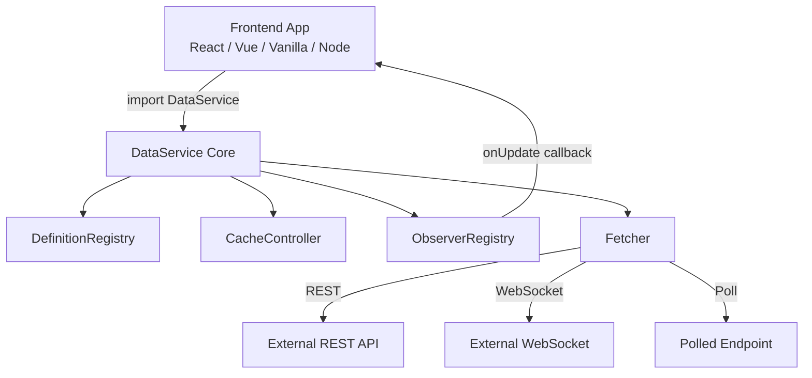
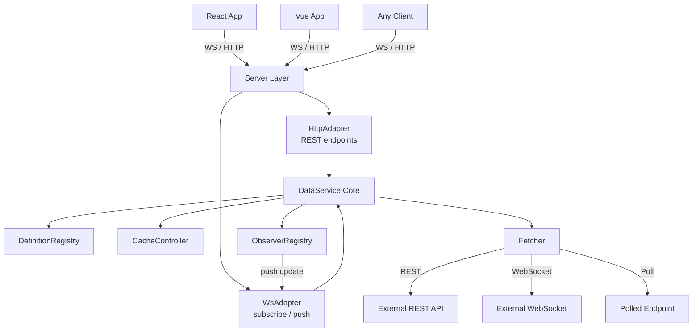
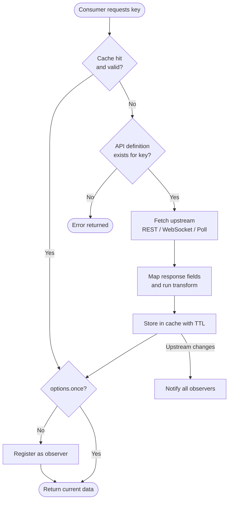
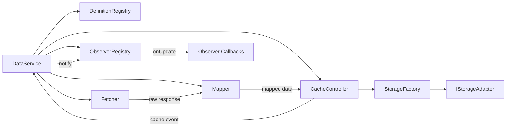
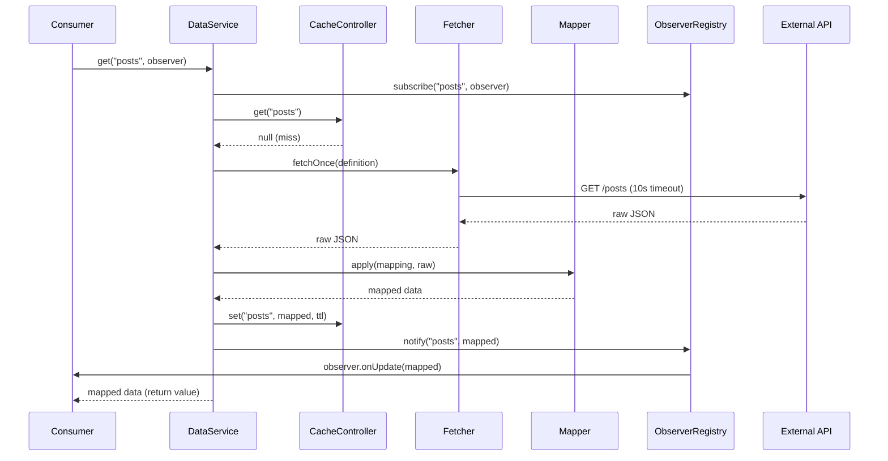
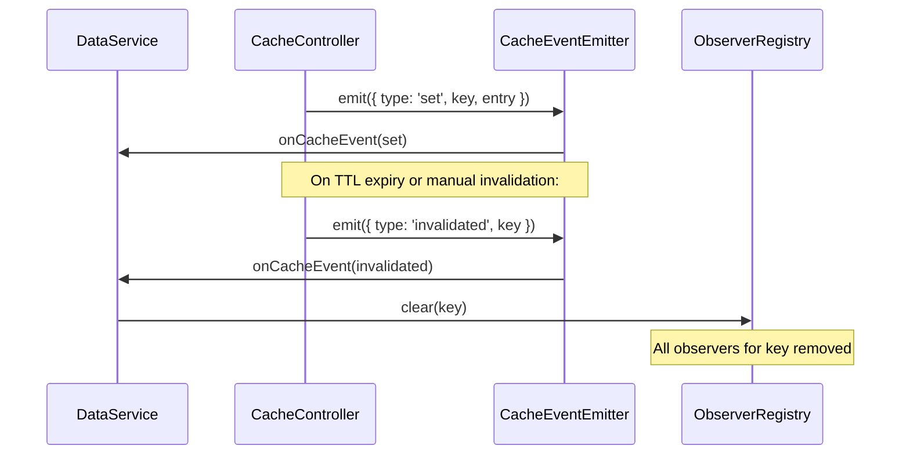

# Architecture

## Overview

DataService is structured as a layered system. The core logic (fetching, caching, mapping, observing) is completely independent of the deployment target. A thin adapter layer on top exposes it as either an importable library or a running HTTP + WebSocket server.

## Deployment modes

### Library mode



### Microservice mode



---

## Request flow



---

## Module relationships



---

## File structure

```
DataService/
├── core/                          Core logic — mode-agnostic
│   ├── DataService.ts             Main entry point, orchestrates all modules
│   ├── DefinitionRegistry.ts      Stores API definitions by key
│   ├── ObserverRegistry.ts        Manages per-key observer callbacks
│   ├── Fetcher.ts                 REST / WebSocket / polling transports
│   ├── Mapper.ts                  Dot-path field extraction and remapping
│   ├── interfaces/
│   │   ├── IApiDefinition.ts      API definition schema
│   │   └── IObserver.ts           Observer callback interface
│   └── cache/                     Cache subsystem
│       ├── CacheController.ts     Public surface for all cache operations
│       ├── adapters/              Storage backends (Memory/LocalStorage/SessionStorage/IndexedDB)
│       ├── commands/              Command objects (Get/Set/Delete/Clear/Invalidate)
│       ├── factory/               StorageFactory — creates and auto-selects adapters
│       ├── observers/             CacheEventEmitter — lifecycle event pub/sub
│       └── interfaces/            IStorageAdapter, ICacheEntry, ICacheCommand, ICacheObserver
│
├── lib/                           Library mode entry point (npm exports)
│   └── index.ts
│
├── server/                        Microservice mode
│   ├── index.ts                   Server bootstrap (Express + WebSocket)
│   ├── HttpAdapter.ts             REST API routes
│   ├── WsAdapter.ts               WebSocket subscribe/push logic
│   ├── config.ts                  Loads definitions.json
│   └── validateDefinition.ts      URL + schema validation (SSRF prevention)
│
├── definitions.json               Example API definitions for microservice mode
├── package.json
└── tsconfig.json
```

---

## Data flow — REST fetch (detailed)



---

## Cache event chain


