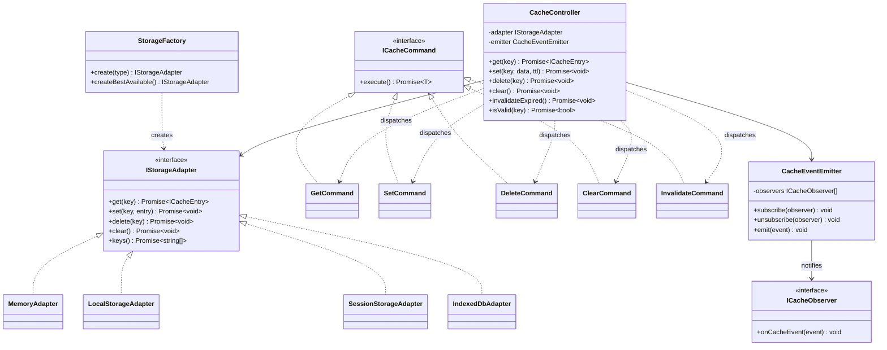
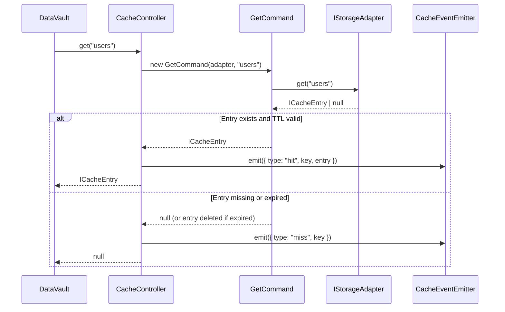
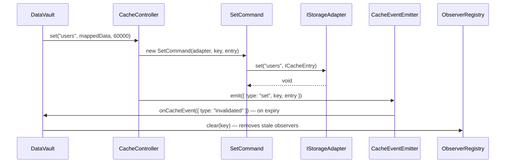
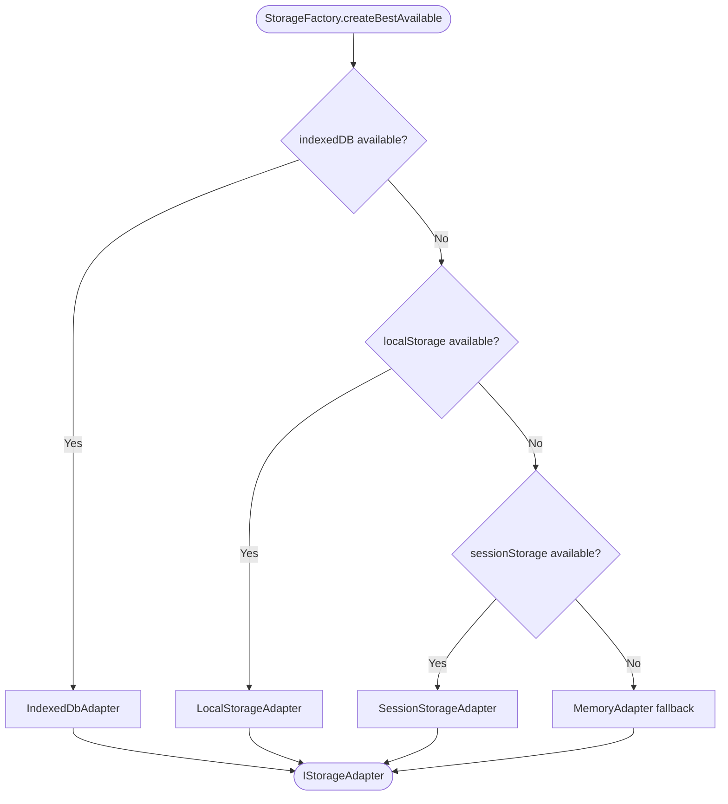

# Cache Design

The cache is a fully self-contained subsystem. It is built around five design patterns (Command, Factory, Adapter, Controller, Observer) and SOLID principles, so adding a new backend requires writing one class and one line in the factory — nothing else changes.

## Class diagram



---

## SOLID mapping

| Principle | Application |
|---|---|
| **Single Responsibility** | Each class does one job: adapters handle I/O, commands encapsulate one operation each, the controller orchestrates, the factory creates |
| **Open / Closed** | Add a new backend by writing a new adapter class — zero changes to existing code |
| **Liskov Substitution** | Any `IStorageAdapter` can be swapped in without changing any call site |
| **Interface Segregation** | `IStorageAdapter` is lean — adapters are not forced to implement operations they don't support |
| **Dependency Inversion** | `CacheController` depends on `IStorageAdapter` (abstraction), never on concrete adapter classes |

---

## Pattern roles

| Pattern | Applied To | Purpose |
|---|---|---|
| **Adapter** | `*StorageAdapter` classes | Wrap browser/Node storage APIs behind a uniform interface |
| **Command** | `Get/Set/Delete/Clear/InvalidateCommand` | Encapsulate each operation as an executable object |
| **Factory** | `StorageFactory` | Create the right adapter; auto-detect environment capabilities |
| **Controller** | `CacheController` | Single public surface; dispatch commands, enforce TTL, emit events |
| **Observer** | `CacheEventEmitter` + `ICacheObserver` | Broadcast cache lifecycle events to any subscriber |

---

## Cache entry structure

```typescript
interface ICacheEntry {
  key: string;
  data: unknown;
  fetchedAt: number;   // Unix ms timestamp of when data was stored
  ttl: number;         // ms; 0 = never expires
}
```

TTL check: `Date.now() - fetchedAt > ttl`

---

## get() flow



---

## set() flow



---

## Factory decision tree



---

## Cache events

| Event | When emitted | Includes |
|---|---|---|
| `set` | Entry stored | `key`, `entry` |
| `hit` | Valid entry returned on get | `key`, `entry` |
| `miss` | Entry not found or expired | `key` |
| `deleted` | Entry explicitly deleted | `key` |
| `cleared` | All entries removed | — |
| `invalidated` | Expired entry removed by `invalidateExpired()` | `key` |

`DataVault` subscribes to the `invalidated` event and clears all data observers for that key, preventing stale callbacks.

---

## TTL behaviour

| `cacheTTL` | Behaviour |
|---|---|
| `0` | Entry never expires (fetched once, cached indefinitely) |
| `> 0` | Entry expires `cacheTTL` ms after it was stored |

Expiry is **lazy**: checked on `get()`. An expired entry is deleted at that point and a `miss` event is emitted. `invalidateExpired()` does a full scan to delete all expired entries at once.
