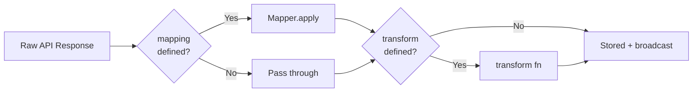

# Data Mapping

When an upstream API returns data, DataVault can reshape it before storing and broadcasting it. Two mechanisms are available: **mapping** (declarative field extraction) and **transform** (arbitrary function).

Both are optional. If neither is provided, the raw response is stored and broadcast as-is.

---

## Mapping

`mapping` is a `Record<string, string>` where:
- Each **key** is the field name in the stored/broadcast object
- Each **value** is a dot-notation path into the raw API response

```typescript
mapping: {
  temperature: 'current.temp_f',
  condition:   'current.condition.text',
  humidity:    'current.humidity',
}
```

### Dot-notation path resolution

Paths traverse nested objects by splitting on `.`. If any segment is `null`, `undefined`, or missing, the result is `undefined` (never throws).

```typescript
const raw = {
  current: {
    temp_f: 72,
    condition: { text: 'Sunny' },
    humidity: 55,
  }
};
```

| Path | Result |
|---|---|
| `'current.temp_f'` | `72` |
| `'current.condition.text'` | `'Sunny'` |
| `'current.humidity'` | `55` |
| `'current.wind.speed'` | `undefined` |
| `'missing.field'` | `undefined` |

### Result

Given the mapping above and the raw response, the stored and broadcast value is:

```json
{
  "temperature": 72,
  "condition": "Sunny",
  "humidity": 55
}
```

### No mapping

If `mapping` is omitted, the full raw response is stored:

```json
{
  "current": {
    "temp_f": 72,
    "condition": { "text": "Sunny" },
    "humidity": 55
  }
}
```

---

## Transform

`transform` is a function `(raw: unknown) => unknown`. It runs **after** mapping (or after the raw response if no mapping is defined). Its return value is what gets stored and broadcast.

```typescript
transform: (data) => ({
  ...(data as object),
  lastUpdated: new Date().toISOString(),
  source: 'weather-api',
})
```

### Order of operations



### Use cases for transform

| Use case | Example |
|---|---|
| Add computed fields | `{ ...data, fullName: data.first + ' ' + data.last }` |
| Slice an array | `(data as unknown[]).slice(0, 10)` |
| Normalize values | `{ ...data, price: Number(data.price).toFixed(2) }` |
| Add metadata | `{ ...data, fetchedAt: Date.now() }` |
| Filter items | `(data as unknown[]).filter(item => item.active)` |

> `transform` is a function and **cannot be included in `definitions.json`**. It is only available when calling `registerDefinition()` directly in library mode.

---

## Using Mapper directly

`Mapper` is a static utility you can use independently of `DataVault`:

```typescript
import { Mapper } from '@banditintinc/datavault';

const raw = { user: { profile: { name: 'Alice', age: 30 } } };

// Extract a single value
Mapper.resolve('user.profile.name', raw);    // → 'Alice'
Mapper.resolve('user.profile.missing', raw); // → undefined

// Remap multiple fields
Mapper.apply(
  { displayName: 'user.profile.name', years: 'user.profile.age' },
  raw
);
// → { displayName: 'Alice', years: 30 }
```

---

## Full example

API response:
```json
{
  "id": 1,
  "userId": 5,
  "title": "sunt aut facere...",
  "body": "quia et suscipit..."
}
```

Definition:
```typescript
ds.registerDefinition({
  key: 'post.1',
  url: 'https://jsonplaceholder.typicode.com/posts/1',
  type: 'rest',
  cacheTTL: 60_000,
  mapping: {
    id:     'id',
    title:  'title',
    body:   'body',
    author: 'userId',
  },
  transform: (data) => ({
    ...(data as object),
    title: (data as { title: string }).title.toUpperCase(),
  }),
});
```

Stored and broadcast value:
```json
{
  "id": 1,
  "title": "SUNT AUT FACERE...",
  "body": "quia et suscipit...",
  "author": 5
}
```
