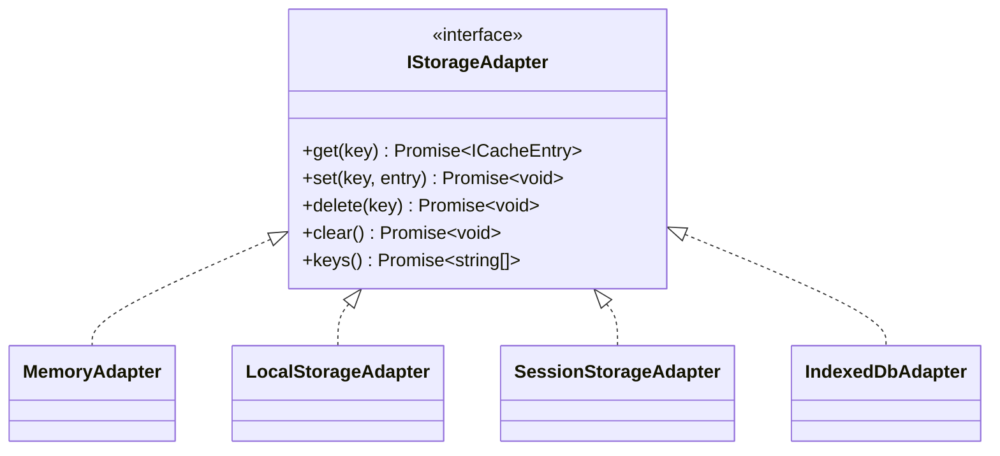
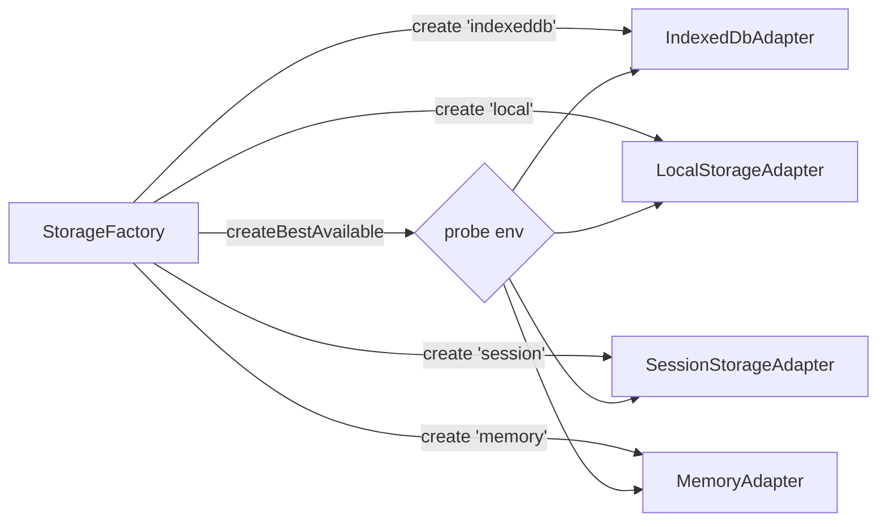
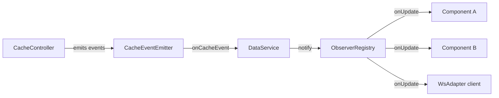

# Design Patterns

DataService is built on five core design patterns applied consistently throughout the codebase. Each pattern has a specific, non-overlapping role.

---

## Adapter

**Files:** `core/cache/adapters/`  
**Interface:** `IStorageAdapter`

The Adapter pattern wraps four different storage APIs — `Map`, `localStorage`, `sessionStorage`, and `IndexedDB` — behind a single identical interface. The rest of the system calls the same five methods regardless of which backend is active.



**Why it matters:** Swapping storage backends requires changing one line in the constructor. Adding a new backend (e.g., Redis, CookieStorage) requires writing one class and nothing else.

---

## Factory

**File:** `core/cache/factory/StorageFactory.ts`

The Factory pattern is the only place in the codebase that knows about concrete adapter classes. Everything else depends on `IStorageAdapter`.

```typescript
class StorageFactory {
  static create(type: StorageType): IStorageAdapter;
  static createBestAvailable(): IStorageAdapter;
}
```

`createBestAvailable()` probes the environment and returns the most capable adapter available, making library and microservice mode work transparently without conditional logic at the call site.



---

## Command

**Files:** `core/cache/commands/`  
**Interface:** `ICacheCommand<T>`

Each cache operation is encapsulated as an object. `CacheController` never calls the storage adapter directly — it always dispatches through a command.

```typescript
interface ICacheCommand<T = unknown> {
  execute(): Promise<T>;
}
```

| Command | Operation |
|---|---|
| `GetCommand` | `adapter.get(key)` |
| `SetCommand` | `adapter.set(key, entry)` |
| `DeleteCommand` | `adapter.delete(key)` |
| `ClearCommand` | `adapter.clear()` |
| `InvalidateCommand` | Parallel scan of all keys, delete expired |

**Why it matters:** Adding new cache operations (e.g., batch get, TTL peek) means adding a new command class, not modifying `CacheController`. Operations can be logged, queued, or replayed without touching the controller.

---

## Controller

**File:** `core/cache/CacheController.ts`

`CacheController` is the single public surface of the entire cache subsystem. Consumers (including `DataService`) call only this class. It:

1. Instantiates and dispatches commands
2. Enforces TTL expiry before returning results
3. Holds the `CacheEventEmitter` and emits events after each operation

```typescript
class CacheController {
  get(key)             → dispatches GetCommand  + emits hit/miss
  set(key, data, ttl)  → dispatches SetCommand  + emits set
  delete(key)          → dispatches DeleteCommand + emits deleted
  clear()              → dispatches ClearCommand  + emits cleared
  invalidateExpired()  → dispatches InvalidateCommand + emits invalidated per key
}
```

**Why it matters:** The controller is the single gate. TTL logic, event emission, and command dispatch all live in one place — none of it leaks into adapters or commands.

---

## Observer

**Files:** `core/cache/observers/CacheEventEmitter.ts`, `core/ObserverRegistry.ts`

Two independent observer systems serve different purposes.

### CacheEventEmitter — cache lifecycle events

Notifies internal subscribers (like `DataService`) about cache state changes.

```typescript
type CacheEventType = 'set' | 'hit' | 'miss' | 'invalidated' | 'deleted' | 'cleared';

interface ICacheObserver {
  onCacheEvent(event: CacheEvent): void;
}
```

`DataService` subscribes to `'invalidated'` events to automatically clear data observers for keys whose cache entries have expired.

### ObserverRegistry — data update subscribers

Notifies external consumers (components, callbacks) when cached data changes.

```typescript
interface IObserver {
  id: string;
  onUpdate: (data: unknown) => void;
}
```

Uses a `Map<key, Map<id, IObserver>>` structure for O(1) subscribe, unsubscribe, and dedup. Observer callbacks are wrapped in `try/catch` — one failing callback never blocks others.



---

## SOLID in practice

The five patterns together enforce all five SOLID principles:

| Principle | Enforced by |
|---|---|
| **S** — Single Responsibility | Each class has one job: adapters do I/O, commands encapsulate one operation, factory creates, controller orchestrates, emitter broadcasts |
| **O** — Open/Closed | New storage backend → new adapter class, zero existing changes. New cache operation → new command class, zero existing changes. |
| **L** — Liskov Substitution | Any `IStorageAdapter` can substitute any other at any call site |
| **I** — Interface Segregation | `IStorageAdapter` exposes only what all adapters can support; `ICacheCommand` exposes only `execute()` |
| **D** — Dependency Inversion | `CacheController` depends on `IStorageAdapter`; `DataService` depends on `CacheController` — both are abstractions, never concrete classes |
