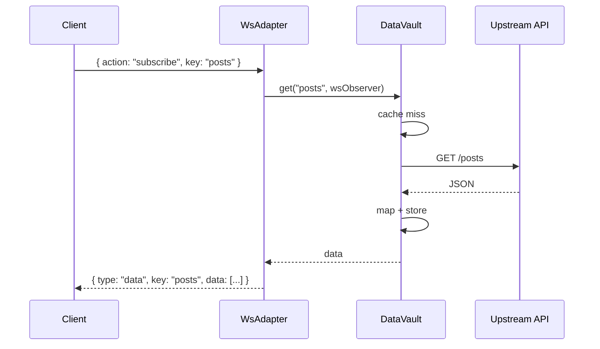
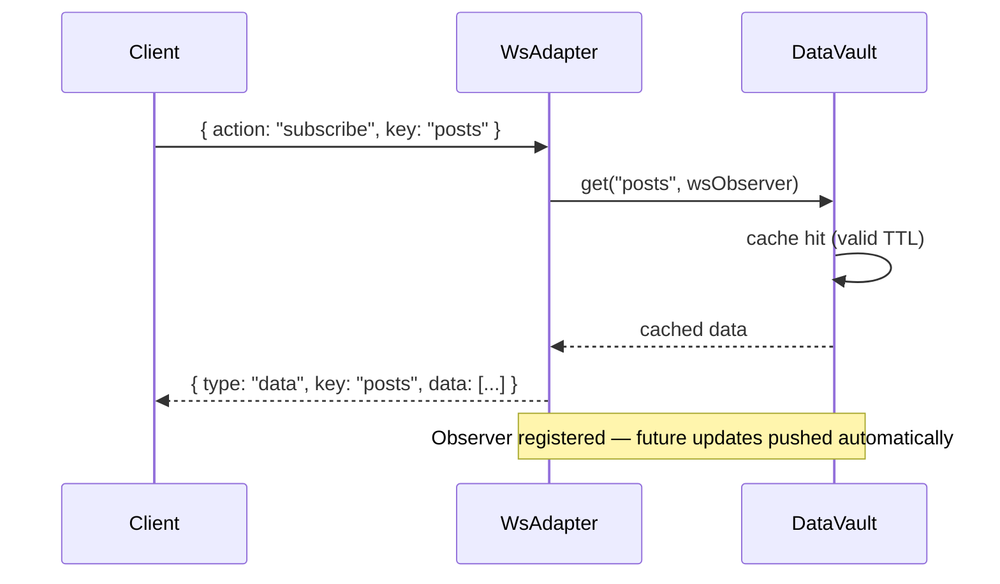
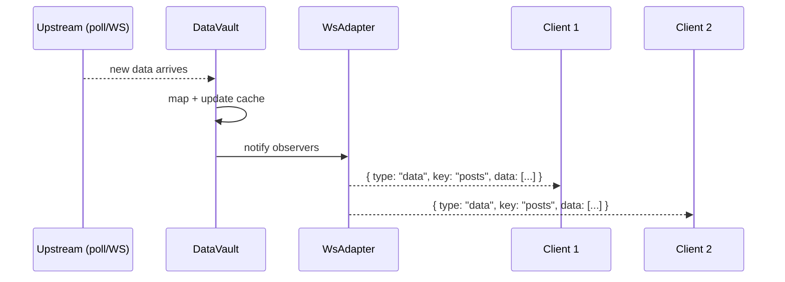

# Microservice Mode

In microservice mode DataVault runs as a standalone server. Any frontend or service connects over HTTP or WebSocket — no shared process required.

## Starting the server

```bash
npm run server
```

Environment variables:

| Variable | Default | Description |
|---|---|---|
| `PORT` | `3000` | HTTP and WebSocket port |
| `DEFINITIONS_FILE` | `./definitions.json` | Path to definitions config file |
| `STORAGE` | `memory` | Storage backend: `memory`, `local`, `session`, `indexeddb` |

```bash
PORT=8080 DEFINITIONS_FILE=./prod-definitions.json STORAGE=memory npm run server
```

Startup output:
```
[Config] Loaded 2 definition(s) from /path/to/definitions.json
[DataVault] HTTP  → http://localhost:3000/api
[DataVault] WS    → ws://localhost:3000/ws
[DataVault] Storage mode: memory
```

---

## HTTP API

All endpoints are prefixed with `/api`.

### `GET /api/health`

Returns server uptime.

```json
{ "status": "ok", "uptime": 42.7 }
```

---

### `GET /api/definitions`

Lists all registered definitions. The `transform` function is omitted (not serializable).

```json
[
  {
    "key": "posts",
    "url": "https://jsonplaceholder.typicode.com/posts",
    "type": "rest",
    "method": "GET",
    "cacheTTL": 30000
  }
]
```

---

### `POST /api/definitions`

Registers a new definition at runtime. The body must be a valid `IApiDefinition` object. See [[Definitions]] for the full schema.

**Request:**
```json
{
  "key": "weather",
  "url": "https://api.weather.example.com/current",
  "type": "rest",
  "method": "GET",
  "cacheTTL": 60000
}
```

**Response `201`:**
```json
{ "registered": "weather" }
```

**Response `400`** (validation failure):
```json
{ "error": "URL targets a private or loopback address which is not allowed." }
```

Note: URLs pointing to private IP ranges or loopback addresses are rejected. See [[Security]].

---

### `GET /api/data/:key`

One-time fetch for a key. Returns cached data if valid, otherwise fetches upstream. No observer is registered.

```bash
curl http://localhost:3000/api/data/posts
```

**Response `200`:**
```json
{
  "key": "posts",
  "data": [{ "id": 1, "title": "..." }, ...]
}
```

**Response `404`:**
```json
{ "error": "[DataVault] No definition registered for key \"unknown\"" }
```

---

### `DELETE /api/data/:key`

Clears the cached value for a key and fetches fresh data from upstream.

```bash
curl -X DELETE http://localhost:3000/api/data/posts
```

**Response `200`:**
```json
{ "refreshed": "posts" }
```

---

## WebSocket protocol

Connect to `ws://localhost:3000/ws`.

### Client → Server messages

All messages are JSON. The `key` field is required in every message.

**Subscribe** — register for ongoing updates:
```json
{ "action": "subscribe", "key": "posts" }
```

**Get** — one-time fetch, no subscription:
```json
{ "action": "get", "key": "posts" }
```

**Unsubscribe** — stop receiving updates:
```json
{ "action": "unsubscribe", "key": "posts" }
```

**Refresh** — force re-fetch and notify all subscribers:
```json
{ "action": "refresh", "key": "posts" }
```

### Server → Client messages

**Data delivery:**
```json
{ "type": "data", "key": "posts", "data": [...] }
```

**Unsubscribe confirmation:**
```json
{ "type": "unsubscribed", "key": "posts" }
```

**Error:**
```json
{ "type": "error", "key": "posts", "message": "No definition registered for key \"posts\"" }
```

### Key validation rules

| Rule | Detail |
|---|---|
| Required | Every message must include `key` |
| Max length | 128 characters |
| Allowed characters | `a-z A-Z 0-9 . - _ :` |

Messages with invalid keys receive an error response and are otherwise ignored.

---

## WebSocket sequence diagrams

### Subscribe + cache miss



### Subscribe + cache hit



### Upstream update pushed to subscribers



---

## Full browser client example

```javascript
const ws = new WebSocket('ws://localhost:3000/ws');

ws.onopen = () => {
  // Subscribe for live updates
  ws.send(JSON.stringify({ action: 'subscribe', key: 'posts' }));
};

ws.onmessage = (event) => {
  const msg = JSON.parse(event.data);

  if (msg.type === 'data') {
    console.log(`[${msg.key}]`, msg.data);
  } else if (msg.type === 'error') {
    console.error('Error:', msg.message);
  }
};

ws.onclose = () => console.log('Disconnected');

// Later: unsubscribe
ws.send(JSON.stringify({ action: 'unsubscribe', key: 'posts' }));
```
