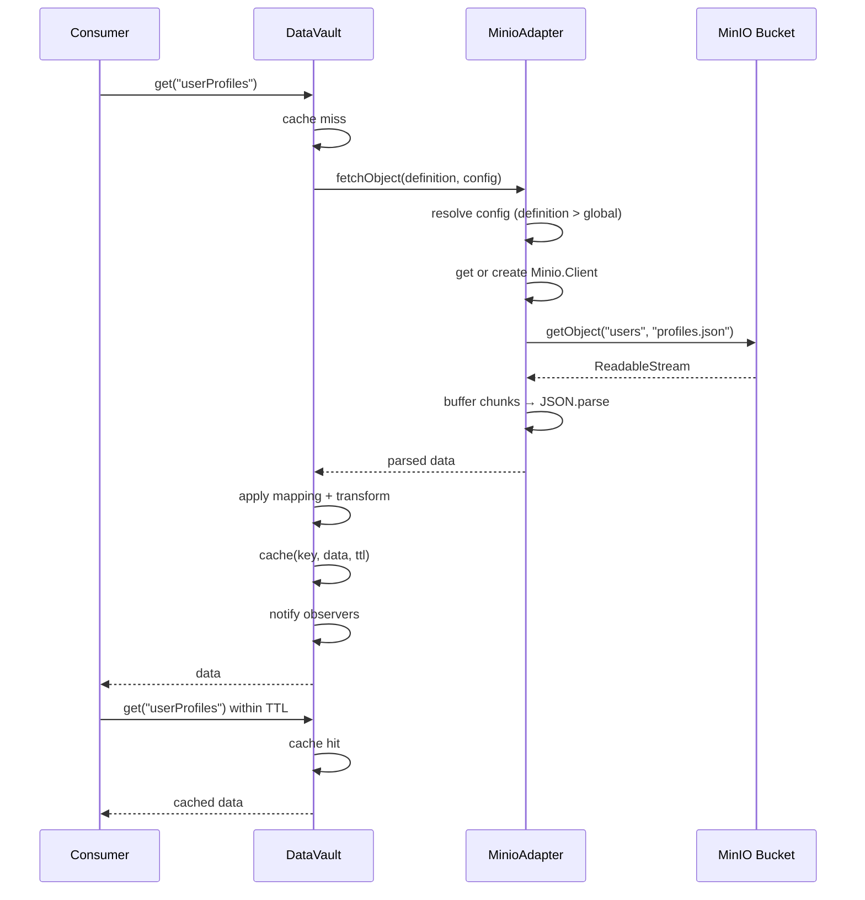

# MinIO Adapter

DataVault's MinIO adapter lets you fetch objects directly from a MinIO (or any S3-compatible) bucket and serve them through the same cache-and-observer pipeline as any other data source.

---

## Install

The `minio` SDK is included as a dependency — no extra install needed.

```bash
npm install @banditintinc/datavault
```

---

## Quick start

```typescript
import { DataVault } from '@banditintinc/datavault';

const ds = new DataVault({
  storage: 'memory',
  minio: {
    endPoint: 'play.min.io',
    port: 9000,
    useSSL: true,
    accessKey: 'minioadmin',
    secretKey: 'minioadmin',
  }
});

ds.registerDefinition({
  key: 'userProfiles',
  type: 'minio',
  bucket: 'users',
  objectKey: 'profiles.json',
  cacheTTL: 300_000,
});

const profiles = await ds.get('userProfiles');
```

---

## Connection config — `IMinioConfig`

Connection credentials are set once on the `DataVault` instance via `DataVaultOptions.minio`. Every `type: 'minio'` definition then inherits that config automatically.

```typescript
import { DataVault, IMinioConfig } from '@banditintinc/datavault';

const minioConfig: IMinioConfig = {
  endPoint: 'play.min.io',
  port: 9000,
  useSSL: true,
  accessKey: 'minioadmin',
  secretKey: 'minioadmin',
  region: 'us-east-1',  // optional
};

const ds = new DataVault({ storage: 'indexeddb', minio: minioConfig });
```

| Field | Type | Required | Default | Description |
|---|---|---|---|---|
| `endPoint` | `string` | Yes | — | MinIO server hostname or IP |
| `port` | `number` | No | `9000` | Server port |
| `useSSL` | `boolean` | No | `true` | Enable TLS |
| `accessKey` | `string` | Yes | — | Access key / username |
| `secretKey` | `string` | Yes | — | Secret key / password |
| `region` | `string` | No | — | Bucket region |

---

## Definition fields

| Field | Type | Required | Description |
|---|---|---|---|
| `key` | `string` | Yes | Unique identifier used in `get()` and `refresh()` |
| `type` | `'minio'` | Yes | Selects the MinIO adapter |
| `bucket` | `string` | Yes | Name of the MinIO bucket |
| `objectKey` | `string` | Yes | Path to the object within the bucket |
| `cacheTTL` | `number` | No | Cache lifetime in ms. `0` = never expires |
| `mapping` | `Record<string, string>` | No | Dot-notation field remapping applied after fetch |
| `transform` | `(raw: unknown) => unknown` | No | Transform function applied after mapping |
| `minioConfig` | `IMinioConfig` | No | Per-definition config override (see below) |

> `url`, `method`, `headers`, `body`, and `pollInterval` are not used by the MinIO adapter.

---

## Caching

The MinIO adapter participates in the standard DataVault cache pipeline. Set `cacheTTL` to control how long a fetched object stays valid before the next `get()` re-fetches from the bucket.

```typescript
ds.registerDefinition({
  key: 'config',
  type: 'minio',
  bucket: 'app',
  objectKey: 'config.json',
  cacheTTL: 60_000,   // re-fetch from bucket after 1 minute
});

await ds.get('config');   // fetches from bucket, caches result
await ds.get('config');   // returns cache — no bucket call
await ds.refresh('config');  // clears cache, re-fetches immediately
```

---

## Observers

Like all other transport types, MinIO definitions support the full observer API.

```typescript
ds.registerDefinition({
  key: 'reports',
  type: 'minio',
  bucket: 'analytics',
  objectKey: 'monthly.json',
  cacheTTL: 3_600_000,
});

ds.get('reports', {
  id: 'dashboard',
  onUpdate: (data) => renderDashboard(data),
});

// Force a refresh — observer is notified with fresh data
await ds.refresh('reports');

// Stop receiving updates
ds.unsubscribe('reports', 'dashboard');
```

---

## Mapping and transforms

Fetched objects pass through the same mapping and transform pipeline as REST responses.

```typescript
ds.registerDefinition({
  key: 'settings',
  type: 'minio',
  bucket: 'config',
  objectKey: 'app-settings.json',
  cacheTTL: 300_000,
  mapping: {
    theme: 'ui.theme',
    language: 'ui.locale',
    timeout: 'network.requestTimeoutMs',
  },
  transform: (d) => {
    const data = d as Record<string, unknown>;
    return { ...data, timeout: Number(data.timeout) / 1000 };  // ms → seconds
  },
});
```

See [[Data-Mapping]] for full mapping syntax.

---

## Per-definition config override

If your app connects to multiple MinIO instances, you can override the global config on a per-definition basis. The per-definition `minioConfig` always takes precedence.

```typescript
const ds = new DataVault({ storage: 'memory', minio: primaryConfig });

// This definition hits a different MinIO instance
ds.registerDefinition({
  key: 'archiveData',
  type: 'minio',
  bucket: 'archive',
  objectKey: 'snapshot.json',
  minioConfig: {
    endPoint: 'archive.min.io',
    port: 9000,
    useSSL: true,
    accessKey: 'archiveKey',
    secretKey: 'archiveSecret',
  },
});
```

---

## Client caching

A single `Minio.Client` instance is created per unique `endPoint + port + accessKey` combination and reused for all subsequent fetches against that server. You pay the connection setup cost once, not on every `get()`.

---

## JSON and non-JSON objects

The adapter buffers the full object stream and attempts `JSON.parse`. If parsing fails it returns the raw string — useful for plain text config files, CSVs, or other non-JSON content.

```typescript
ds.registerDefinition({
  key: 'motd',
  type: 'minio',
  bucket: 'content',
  objectKey: 'message-of-the-day.txt',
  cacheTTL: 3_600_000,
});

const message = await ds.get('motd');  // returns a plain string
```

---

## Error handling

| Scenario | Behaviour |
|---|---|
| No `minio` config on DataVault and no `minioConfig` on definition | Throws: `MinIO config required for key "..."` |
| `bucket` or `objectKey` missing from definition | Throws: `requires "bucket" and "objectKey"` |
| Object not found in bucket | MinIO SDK error propagates (e.g. `NoSuchKey`) |
| Network / auth failure | MinIO SDK error propagates |

```typescript
try {
  const data = await ds.get('userProfiles');
} catch (err) {
  console.error('MinIO fetch failed:', err.message);
}
```

---

## Fetch lifecycle



---

## S3 compatibility

Because MinIO is S3-compatible, this adapter works with any S3-compatible object store by pointing `endPoint` at the appropriate host.

| Service | `endPoint` | Notes |
|---|---|---|
| MinIO (self-hosted) | Your server hostname | Set `port` and `useSSL` as needed |
| MinIO Cloud | `<tenant>.min.io` | `useSSL: true`, port `443` |
| Cloudflare R2 | `<accountid>.r2.cloudflarestorage.com` | `useSSL: true`, port `443` |
| Backblaze B2 | `s3.<region>.backblazeb2.com` | `useSSL: true`, port `443` |
| Ceph RadosGW | Your Ceph gateway hostname | Varies by deployment |
