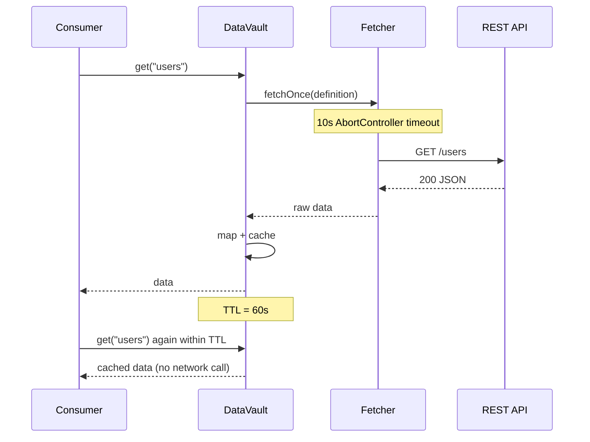
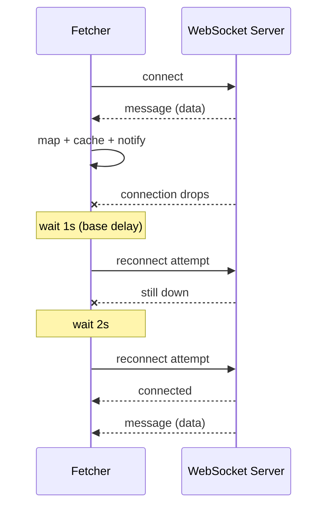
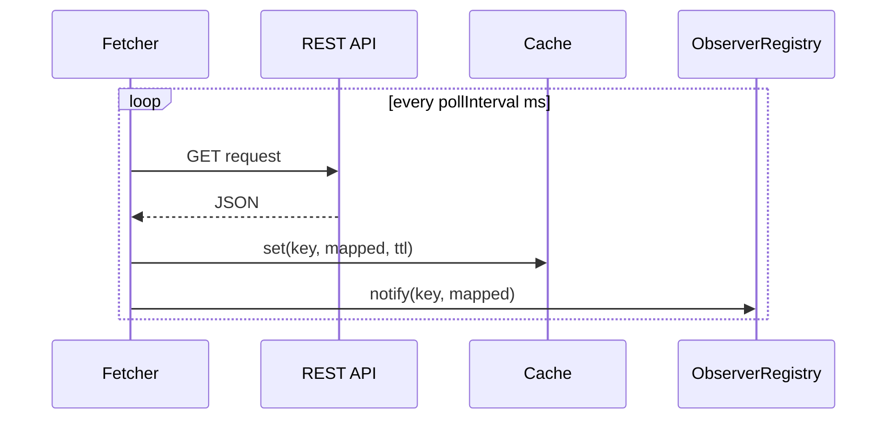

# Transport Types

DataVault supports three upstream transport types, each suited to a different data delivery model.

## REST

A single HTTP request is made each time data is needed.

```typescript
ds.registerDefinition({
  key: 'users',
  url: 'https://api.example.com/users',
  type: 'rest',
  method: 'GET',
  cacheTTL: 60_000,
});
```

**Lifecycle:**
- No connection is opened at `registerDefinition()`
- A request is made on the first `get()` call (cache miss)
- Subsequent `get()` calls return the cached value until TTL expires
- `refresh()` forces a new request regardless of cache state

**Options used:** `url`, `method`, `headers`, `body`, `cacheTTL`, `mapping`, `transform`

**Timeout:** All REST requests have a 10-second timeout. Stalled connections are aborted.



---

## WebSocket

A persistent connection is opened immediately when the definition is registered. Data arrives via server push.

```typescript
ds.registerDefinition({
  key: 'live.prices',
  url: 'wss://stream.example.com/prices',
  type: 'websocket',
  mapping: { symbol: 'ticker', price: 'last' },
});
```

**Lifecycle:**
- Connection opened at `registerDefinition()`
- Incoming messages are parsed (JSON), mapped, cached, and sent to observers
- On disconnect: reconnects with exponential backoff starting at 1s, capping at 30s
- `stopWatching()` / `destroy()` closes the connection permanently — no reconnect

**Auto-reconnect:**



**Options used:** `url`, `cacheTTL`, `mapping`, `transform`

> `method`, `headers`, `body`, and `pollInterval` are ignored for WebSocket definitions.

---

## Poll

Periodic HTTP requests are made on an interval.

```typescript
ds.registerDefinition({
  key: 'stock.AAPL',
  url: 'https://api.example.com/quote?symbol=AAPL',
  type: 'poll',
  pollInterval: 15_000,  // every 15 seconds
  cacheTTL: 15_000,
  mapping: { price: 'quote.latestPrice' },
});
```

**Lifecycle:**
- Polling interval starts immediately at `registerDefinition()`
- Each tick makes a REST request, maps the result, caches it, and notifies observers
- Minimum `pollInterval` is 1000ms (enforced in both validator and Fetcher)
- `stopWatching()` / `destroy()` clears the interval

**Options used:** `url`, `method`, `headers`, `body`, `pollInterval`, `cacheTTL`, `mapping`, `transform`



---

## Comparison

| | REST | WebSocket | Poll |
|---|---|---|---|
| **Connection** | Per request | Persistent | Per interval |
| **Starts at** | First `get()` | `registerDefinition()` | `registerDefinition()` |
| **Push support** | No | Yes | No |
| **Auto-reconnect** | N/A | Yes (exp. backoff) | N/A |
| **Best for** | Infrequent, on-demand data | Real-time live data | Periodically changing data without push support |
| **Fetch timeout** | 10s | N/A | 10s per request |
| **Minimum interval** | N/A | N/A | 1000ms |
